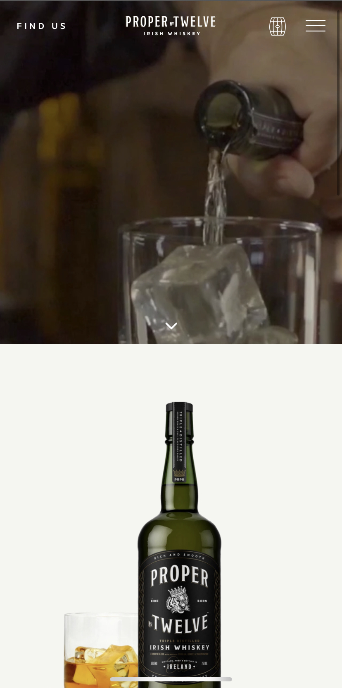
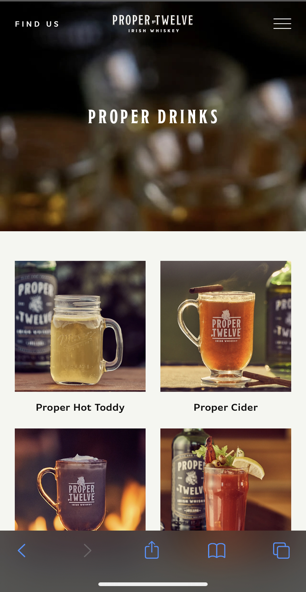

# Procesverslag
**Auteur:** -Menno Vlaming-

Markdown cheat cheet: [Hulp bij het schrijven van Markdown](https://github.com/adam-p/markdown-here/wiki/Markdown-Cheatsheet). Nb. de standaardstructuur en de spartaanse opmaak zijn helemaal prima. Het gaat om de inhoud van je procesverslag. Besteedt de tijd voor pracht en praal aan je website.

## Bronnenlijst
1. -bron 1-
2. -bron 2-
3. -...-

## Eindgesprek (week 7/8)

-dit ging goed & dit was lastig-

**Screenshot(s):**

-screenshot(s) van je eindresultaat-

## Voortgang 3 (week 6)

-same as voortgang 1-

## Voortgang 2 (week 5)

-same as voortgang 1-

## Voortgang 1 (week 3)
-Bij voortgang 1 heb ik nog niet gekeken naar het juist vormgeven, maar het maken van een responsive layout met CSS mediaqueries en flexbox, dit is nog niet helemaal gelukt maar er zal niet heel veel tijd meer in gaan zitten.-

### Stand van zaken

-dit ging goed & dit was lastig-

**Screenshot(s):**

-screenshot(s) van hoe ver je bent met korte uitleg-

### Agenda voor meeting

-samen met je groepje opstellen-

| Menno      | Aron          | Christiaan    | student 4        |
| ---            | ---                | ---          | ---              |
| Responsiveness CSS  | CSS controleren             | HTML checken    | en dan ik dat    |
| Flexbox | semantiek HTML | positionering vragen | ... |
| ...            | ...                | ...          | ...              |

### Verslag van meeting

-na afloop snel uitkomsten vastleggen-

## Breakdownschets (week 1)

-uitwerken voor de 1e werkgroep - eind van de eerste week-

## Intake (week 1)
-uitwerken voor de kick-off werkgroep - begin van de eerste week-

**Je startniveau:** Rood

**Je focus:** Helemaal responsive

**Je opdracht:** https://properwhiskey.com

**Screenshot(s) van de eerste pagina (small screen):**

**Screenshot(s) van de tweede pagina (small screen):**

